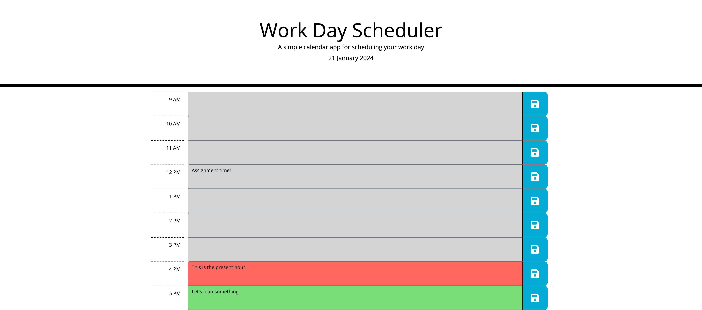

# Work Day Scheduler
A simple work day scheduler app to manage hourly timeblocks

## Description

The aim of this project was to create a simple calendar application to enter and maintain the day's work in hourly timeblocks.\
Code was written in javascript using JQuery library to access DOM elements. Day.js (https://day.js.org/docs/en/display/format) library was used to work with all the date and times on the page. The application features dynamically updated HTML and CSS Bootstrap powered through javascript and javascript libraries.

Version control was through git and the updated repository can be found at:

https://github.com/ShaliniSunkuru/work-day-scheduler   

## Table of Contents

- [User Story](#user-story)
- [Acceptance Critera](#acceptance-criteria)
- [Screenshot](#screenshot)
- [Technology Used](#technology-used)
- [Deployment](#deployment)
- [Usage](#usage)
- [Credits](#credits)
- [License](#license)

## User Story

AS an employee with a busy schedule\
I WANT to add important events to a daily planner\
SO THAT I can manage my time efficiently.

## Acceptance Criteria

GIVEN an application to schedule daily work\
WHEN I open the application in the browser\
I see the current day at the top of the planner\
WHEN I browse further down\
I see timeblocks for every hour of my usual work day\ 
The timeblocks are color coded based on past, present and future hours\
and each timeblock has a Save button\
WHEN I click on the text area of a timeblock\
I can enter information\
WHEN I click on the save button\
The text I entered is saved on the page\
WHEN I refresh or reload the application\
The text entered earlier is shown at the corresponding hour\

## Screenshot

Here is a screenshot of the application in a browser with some text added and saved on the page.

## Technology Used

The following tools and technologies were used in this project

- HTML5
- CSS
- Bootstrap
- Javascript
- JQuery
- Day.js
- Visual Studio Code
- GIT
- Github
  
## Deployment

Here is a link to the deployed project.

https://shalinisunkuru.github.io/work-day-scheduler/ 

## Usage

Click on the url for the deployed project.\ 
Note the current date displayed in the header\
Click on a text area and type in something.\
Click on the save button\
Refresh the page to see your entered text saved!\

## Credits

I appreciate the guidance of the instrutor and TAs of edX Bootcamp for making it fun to learn the new concepts of DOM manipulation using JQuery and dayjs to work with dates and times. W3Schools, MDN Documentation, and stack overflow have been a great help in grasping the concepts of javascript. The documentations of the libraries used were helpful.

## License

Please refer to the MIT License in the repository.

